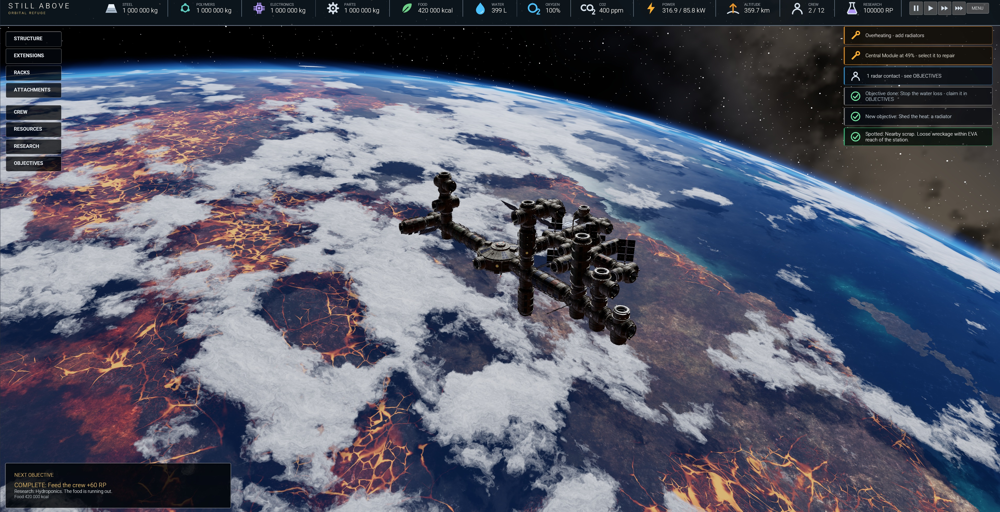

# Still Above: Orbital refuge
Space station simulation game made in Lumix Engine. Design docs are in `design/` (start with `design/game.md`).

Run: open the project in Lumix Studio and enter game mode (`main.evox` is the entry point). Controls are listed in the in-game CONTROLS menu.

## Layout
- `main.evox` - entry point / frame loop; `scripts/` - `config` (all gameplay tuning), `defs` (module catalog, sockets, math), `state`, `sim` (resource simulation), `build` (placement),
  `orbit` (scene + camera), `station_orbit` (Earth-centered flight frame), `modgen` (assembles every module from the kit parts at random), `objectives`, `hud` (in-game UI), `text` (string buffer helper).
- `ui/hud.ui` - generated HUD markup; `ui/flat`, `ui/icons2`, `ui/kit` - its sprites. `gfx/` - Earth, sky and sun shaders, materials and textures. `models/` - generated kit parts (see `models/readme.md`).
- `tools/` - generators for the models, sprites and HUD (Blender / Python / PowerShell) and Studio preview helpers. `design/` - design docs. `concept_art/` - references only, nothing in the game loads them.
- Type-check scripts without the engine: `LumixEngine/external/evox/build/evoxc.exe --typecheck-only --import-dir <project> --core-dir LumixEngine/data/scripts main.evox`.

## HUD
Flat dark-glass skin. Sprites in `ui/flat/` and glyphs in `ui/icons2/` are Evox texture recipes (`.ltct`, shared drawing code in `texgen/`), so they are generated by Studio when the asset compiles; `ui/kit/` only holds the module card thumbnails `th_<n>` and the `ic_check` icon
(`th_8`, the Docking Hub, is rendered from the kit parts by `tools/gen_module_thumbs.py` in Blender).

`tools/gen_hud.py` (any Python 3, e.g. Blender's: `.../5.2/python/bin/python.exe tools/gen_hud.py`) generates `ui/hud.ui`. Edit the generator, not the markup. Ids must match `scripts/hud.evox`.

- Stretching: a nine-slice draws its corners at the texture's pixel size and stretches the rest, so anything textured there smears. The top bar and the toasts are flat `bg-color` boxes with a fixed-size icon, not sprites.
- Labels: a span is not vertically centred by `align-items`, so labels are placed with `padding-top`; tabs need an explicit width or their label wraps.
- Gotchas: text colour must be set on the `[span]` itself (box/class colour does not reach spans); dark text and `bg-color` values render lighter than specified, so use near-black;
  the first `ui.load` is asynchronous (fill texts from a later call). To preview without running the game: `evox_execute` a `main(world)` that calls `world.ui().load("ui/hud.ui")`, then a second call that
  sets texts/visibility by id, then `make_game_screenshot`.
